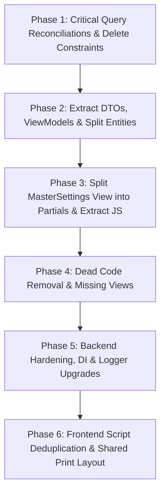

# 📋 Codebase Audit & Architectural Cleanup Plan

> **System**: Inventory Management System (IMS) — ASP.NET Core 8 MVC (.NET 8.0)  
> **Date**: September 16, 2026  
> **Status**: Audit Completed — Ready for Phased Execution  

---

## 📑 Table of Contents
1. [Executive Summary](#1-executive-summary)
2. [Jumbled Code Files Requiring Separation](#2-jumbled-code-files-requiring-separation)
   - [A. DTOs & ViewModels Embedded in Controllers](#a-dtos--viewmodels-embedded-in-controllers)
   - [B. Multiple Entities & Enums Embedded in Domain Model Files](#b-multiple-entities--enums-embedded-in-domain-model-files)
   - [C. ViewModel Folder Structure & Organization](#c-viewmodel-folder-structure--organization)
   - [D. Giant 2,100-Line MasterSettings View & Inline JavaScript](#d-giant-2100-line-mastersettings-view--inline-javascript)
3. [Critical Logic Bugs & Functional Inconsistencies](#3-critical-logic-bugs--functional-inconsistencies)
4. [Dead Code, Broken Links & Orphaned Artifacts](#4-dead-code-broken-links--orphaned-artifacts)
5. [Security, Configuration & Non-Standard Backend Practices](#5-security-configuration--non-standard-backend-practices)
6. [Frontend & JavaScript Hygiene](#6-frontend--javascript-hygiene)
7. [Phased Implementation Roadmap](#7-phased-implementation-roadmap)

---

## 1. Executive Summary

This document presents a comprehensive file-by-file audit of the entire Inventory Management System repository. The purpose is to identify anti-patterns, architectural violations, jumbled files needing separation, critical logic bugs introduced during recent multi-item feature additions, dead code, and security vulnerabilities before executing any refactoring.

---

## 2. Jumbled Code Files Requiring Separation

### A. DTOs & ViewModels Embedded in Controllers
Multiple input models and DTOs are declared directly inside controller files, violating the Single Responsibility Principle and making models inaccessible across layers.

| Current Location | Embedded Class / DTO | Recommended Destination |
| :--- | :--- | :--- |
| `Controllers/AccountController.cs` | `UpdateProfileModel` | `Models/ViewModels/UpdateProfileModel.cs` |
| `Controllers/CustomersController.cs` | `CustomerInputModel` | `Models/ViewModels/CustomerInputModel.cs` |
| `Controllers/PurchasesController.cs` | `PayInstallmentModel` | `Models/ViewModels/PayInstallmentModel.cs` |
| `Controllers/SalesController.cs` | `ReceiveInstallmentModel` | `Models/ViewModels/ReceiveInstallmentModel.cs` |
| `Controllers/SalesController.cs` | `ReminderEmailModel` | `Models/ViewModels/ReminderEmailModel.cs` |
| `Controllers/MasterSettingsController.cs` | `EmployeeInputModel` | `Models/ViewModels/EmployeeInputModel.cs` |
| `Controllers/MasterSettingsController.cs` | `ResetPasswordInputModel` | `Models/ViewModels/ResetPasswordInputModel.cs` |
| `Controllers/MasterSettingsController.cs` | `AccountStatusToggleModel` | `Models/ViewModels/AccountStatusToggleModel.cs` |
| `Controllers/MasterSettingsController.cs` | `AttendanceInputModel` | `Models/ViewModels/AttendanceInputModel.cs` |
| `Controllers/MasterSettingsController.cs` | `CategoryInputModel` | `Models/ViewModels/CategoryInputModel.cs` |
| `Controllers/MasterSettingsController.cs` | `TestSmtpInputModel` | `Models/ViewModels/TestSmtpInputModel.cs` |

---

### B. Multiple Entities & Enums Embedded in Domain Model Files
Domain entity files currently combine multiple database entities, request DTOs, unmapped UI properties, and shared enums.

| Current File | Embedded Type | Issue & Action |
| :--- | :--- | :--- |
| `Models/Product.cs` | `ProductVariantInput` | Input DTO defined in the same file as EF Entity. Move to `Models/ViewModels/ProductVariantInput.cs`. |
| `Models/Product.cs` | `[NotMapped]` properties (`PurchaseRate`, `DemandRate`, `FixRate`, `MultipleVariants`) | Entity pollution with UI/form-only properties. Separate into `ProductCreateViewModel` and `ProductEditViewModel`. |
| `Models/ProductCategory.cs` | `ProductCategoryTypeOption` | Second database entity defined in the same file. Move to its own entity file `Models/ProductCategoryTypeOption.cs`. |
| `Models/Purchase.cs` | `PaymentMode` enum | Shared enum (used across Purchases and Sales) embedded inside `Purchase.cs`. Move to `Models/PaymentMode.cs`. |
| `Models/Purchase.cs` | `[NotMapped] public Supplier? NewSupplier` | Form-binding property on EF Entity. Extract to `PurchaseCreateViewModel`. |
| `Models/Sale.cs` | `[NotMapped]` customer properties (`NewCustomerFirstName`, `NewCustomerLastName`, etc.) | Form-binding properties on EF Entity. Extract to `SaleCreateViewModel`. |

---

### C. ViewModel Folder Structure & Organization
- `Models/ErrorViewModel.cs` & `Models/PrintHeaderViewModel.cs` are located in the `Models/` root while other ViewModels are in `Models/ViewModels/`. Both should be moved into `Models/ViewModels/`.
- `DashboardViewModel.cs` directly references EF entities `List<Product>` and `List<Sale>`. It should use clean summary DTOs (`DashboardProductSummaryDto`, `DashboardSaleSummaryDto`).

---

### D. Giant 2,100-Line MasterSettings View & Inline JavaScript
- **Current Problem**: `Views/MasterSettings/Index.cshtml` is **106 KB (2,108 lines)** containing:
  - 7 major configuration tabs (Employees, Departments, Attendance, Leaves, Categories, SMTP, Company Profile)
  - 8 modal dialogs
  - Over **1,000 lines of raw JavaScript** embedded inside `<script>` tags in the Razor view.
- **Cleanup Strategy**:
  1. Break down HTML into partial views in `Views/MasterSettings/Partials/`:
     - `_EmployeesTab.cshtml`
     - `_DepartmentsTab.cshtml`
     - `_AttendanceTab.cshtml`
     - `_LeavesTab.cshtml`
     - `_CategoriesTab.cshtml`
     - `_SmtpTab.cshtml`
     - `_CompanyProfileTab.cshtml`
  2. Extract all embedded JavaScript out of the Razor view into `wwwroot/js/masterSettings.js`.

---

## 3. Critical Logic Bugs & Functional Inconsistencies

During the audit, several critical logic bugs were discovered where multi-item purchase/sale workflows broke legacy single-item queries:

1. **Reports & Profit/Loss Completely Miss Multi-Item Purchases & Sales**:
   - In `ReportsController.cs` (`GetReportData()` and `GetProfitAndLossData()`), quantity and revenue calculations filter only by `Purchase.ProductId` and `Sale.ProductId`.
   - **Impact**: Any item sold or purchased as part of a multi-item voucher is completely omitted from Product Performance Reports, inventory valuation, and P&L statements.
   - **Fix**: Reconcile queries to aggregate both legacy single-item records and `PurchaseItems` / `SaleItems`.

2. **Foreign Key Crash on Product Deletion**:
   - In `ProductsController.cs` (`Delete()`), the pre-delete check only verifies `Purchases.AnyAsync(p => p.ProductId == id)` and `Sales.AnyAsync(s => s.ProductId == id)`.
   - **Impact**: Attempting to delete a product that exists in `PurchaseItems` or `SaleItems` throws an unhandled SQL Server foreign key constraint exception.
   - **Fix**: Check `PurchaseItems.AnyAsync(pi => pi.ProductId == id)` and `SaleItems.AnyAsync(si => si.ProductId == id)`.

3. **Product Edit Mode Drops Category & ProductType for New Variants**:
   - In `ProductsController.cs` (`Edit()`), when adding new variants dynamically, `CategoryName` and `ProductType` are missing in the newly instantiated variant products.
   - **Fix**: Ensure new variants inherit `CategoryName` and `ProductType` from the main product model.

4. **Admin Dashboard Top 5 Selling Products Ignores Multi-Item Sales**:
   - In `AdminController.cs`, `_context.Sales.Where(s => s.ProductId.HasValue)` ignores multi-item sales in `SaleItems`, displaying inaccurate top-selling rankings.
   - **Fix**: Query both `SaleItems` and legacy `Sales` to calculate total units sold per product.

5. **Supplier "Supplied Products" Column Ignores Multi-Item Purchases**:
   - In `SuppliersController.cs`, `PurchasedProducts` only checks `pu.ProductId`, omitting items purchased via multi-item vouchers.
   - **Fix**: Query both `Purchases` and `PurchaseItems`.

6. **Lease Reminder Email Incomplete for Multi-Item Invoices**:
   - In `SalesController.cs` (`SendReminderEmail()`), `installment.Sale.Product?.Name` is used in the email template, which is null or incomplete for multi-item invoices.
   - **Fix**: Render all item names or the invoice summary in the reminder template.

7. **Concurrency Race Condition in Document Sequence Generation**:
   - In `PurchasesController.cs` and `SalesController.cs`, generating `PurchaseNo` / `InvoiceNo` via `CountAsync() + 1` causes duplicate key errors during simultaneous checkouts.
   - **Fix**: Use thread-safe sequencing or timestamp-with-random suffixes.

---

## 4. Dead Code, Broken Links & Orphaned Artifacts

| Item | Location | Problem | Action |
| :--- | :--- | :--- | :--- |
| **Dead Controller Links** | `Views/Home/Index.cshtml` & `Controllers/AccountController.cs` | Links to `CustomerDashboardController`, which does not exist (causes 404). | Remove or redirect to appropriate view. |
| **Orphaned JS File** | `wwwroot/js/customerDashboard.js` | Leftover script from deleted customer portal. Not loaded anywhere. | Delete file. |
| **Dead Register References** | `Views/Account/ConfirmEmail.cshtml`, `Views/Home/Index.cshtml`, `wwwroot/js/auth.js` | Links/forms submit to `/Account/Register`, but registration action was removed. | Clean up dead HTML links and unused JS handlers. |
| **Unused DB Context Injection** | `Views/Shared/_Layout.cshtml` | `@inject InventoryManagementSystem.Data.InventoryDbContext DbContext` is injected but never used. | Remove line. |
| **Boilerplate CSS Leftovers** | `Views/Shared/_Layout.cshtml.css` | Contains default Visual Studio template CSS rules (`a.navbar-brand`, `button.accept-policy`) that are unused. | Remove unused styles. |
| **Missing View** | `Controllers/AccountController.cs` | `AccessDenied()` returns `View()`, but `Views/Account/AccessDenied.cshtml` does not exist. | Create `Views/Account/AccessDenied.cshtml`. |

---

## 5. Security, Configuration & Non-Standard Backend Practices

1. **Plaintext Secrets in AppSettings**:
   - `appsettings.json` contains a plaintext Gmail App Password.
   - **Recommendation**: Move sensitive credentials to `secrets.json` (via `dotnet user-secrets`) and Environment Variables.
2. **Global Exception Information Leak**:
   - `Filters/AjaxExceptionFilter.cs` returns `context.Exception.Message` to client AJAX callers for 500 errors.
   - **Recommendation**: In production, mask internal server error messages with a generic failure message while logging the full exception.
3. **Obsolete SmtpClient & Direct Service Provider Scope**:
   - `Services/EmailSender.cs` uses obsolete `System.Net.Mail.SmtpClient` and manually creates a DI scope to resolve `InventoryDbContext` because it was registered as `AddTransient`.
   - **Recommendation**: Register `AddScoped<IEmailSender, EmailSender>()`, inject `InventoryDbContext` directly into the constructor, and consider MailKit for long-term production stability.
4. **N+1 SQL Queries in Admin Dashboard**:
   - `AdminController.cs` runs 12 separate queries inside a 6-iteration loop for monthly chart data.
   - **Recommendation**: Group by `Year` and `Month` in a single aggregated LINQ query.
5. **Console.WriteLine in Catch Blocks**:
   - Controllers use `Console.WriteLine` instead of `ILogger<T>`.
   - **Recommendation**: Inject `ILogger<T>` into all controllers and services.
6. **File Upload Working Directory Dependency**:
   - `MasterSettingsController.cs` uses `Directory.GetCurrentDirectory()` for uploads.
   - **Recommendation**: Inject `IWebHostEnvironment.WebRootPath`.

---

## 6. Frontend & JavaScript Hygiene

1. **Global Variable Pollution**:
   - `customers.js`, `products.js`, `purchases.js`, `sales.js`, `suppliers.js` declare `var table;` in the global `window` scope.
   - **Recommendation**: Encapsulate scripts in IIFE closures or namespaced modules (`IMS.Customers = { ... }`).
2. **Duplicated Utility Logic**:
   - The `formatCnic(val)` function is copy-pasted across 4 separate files (`customers.js`, `suppliers.js`, `purchases.js`, `sales.js`).
   - **Recommendation**: Centralize in `wwwroot/js/common.js`.
3. **Duplicate Script Imports**:
   - `jquery.validate.min.js` and `jquery.validate.unobtrusive.min.js` are included globally in `_Layout.cshtml`, making `_ValidationScriptsPartial.cshtml` redundant if rendered in views.
4. **Print Views Lack Shared Print Layout**:
   - `Purchases/Print.cshtml`, `Sales/Print.cshtml`, and `Reports/PrintCustomerStatement.cshtml` duplicate full HTML document structures and styles.
   - **Recommendation**: Create a shared `_PrintLayout.cshtml`.
5. **Inline Script in Shared Layout**:
   - `_Layout.cshtml` has an inline `<script>` block for the Admin profile modal.
   - **Recommendation**: Move to `common.js` or `auth.js`.

---

## 7. Phased Implementation Roadmap

### Phase 1: Critical Business Logic & Query Reconciliations (High Priority)
- [ ] Fix `ReportsController.cs` (`GetReportData` and `GetProfitAndLossData`) to include `PurchaseItems` and `SaleItems`.
- [ ] Fix `ProductsController.cs` (`Delete`) to check `PurchaseItems` and `SaleItems`.
- [ ] Fix `ProductsController.cs` (`Edit`) variant creation to preserve `CategoryName` and `ProductType`.
- [ ] Fix `AdminController.cs` top-selling products query to aggregate `SaleItems`.
- [ ] Fix `SuppliersController.cs` supplied products query to include `PurchaseItems`.
- [ ] Fix `SalesController.cs` installment reminder email template for multi-item invoices.

### Phase 2: Separate Jumbled Classes, DTOs & Models (Structure)
- [ ] Extract the 11 controller-embedded DTOs to `Models/ViewModels/`.
- [ ] Extract `ProductCategoryTypeOption` into its own file `Models/ProductCategoryTypeOption.cs`.
- [ ] Extract `PaymentMode` into its own file `Models/PaymentMode.cs`.
- [ ] Move `ErrorViewModel.cs` and `PrintHeaderViewModel.cs` into `Models/ViewModels/`.

### Phase 3: Split MasterSettings & Layout View Scripts (UI Structure)
- [ ] Break down `Views/MasterSettings/Index.cshtml` into partial views under `Views/MasterSettings/Partials/`.
- [ ] Move the 1,000 lines of inline JavaScript from `MasterSettings/Index.cshtml` to `wwwroot/js/masterSettings.js`.
- [ ] Move the profile modal script from `_Layout.cshtml` to `common.js`.

### Phase 4: Dead Code Removal & Missing Views (Housekeeping)
- [ ] Delete orphaned `wwwroot/js/customerDashboard.js`.
- [ ] Remove dead links to `CustomerDashboard` and `Account/Register` in views and JS.
- [ ] Create missing `Views/Account/AccessDenied.cshtml`.
- [ ] Clean up unused `DbContext` injection in `_Layout.cshtml` and template CSS in `_Layout.cshtml.css`.

### Phase 5: Backend Hardening, DI & Security (Engineering Quality)
- [ ] Update `IEmailSender` registration to `AddScoped` and inject `InventoryDbContext` directly.
- [ ] Replace `Console.WriteLine` with `ILogger<T>` across controllers.
- [ ] Use `IWebHostEnvironment` for file upload paths.
- [ ] Secure secrets and prevent internal exception details from leaking in `AjaxExceptionFilter.cs`.

### Phase 6: Frontend Script Deduplication & Shared Print Layout
- [ ] Centralize `formatCnic` in `common.js`.
- [ ] Wrap page scripts in closures to prevent global variable pollution.
- [ ] Create `_PrintLayout.cshtml` and refactor `Purchases/Print.cshtml`, `Sales/Print.cshtml`, and `Reports/PrintCustomerStatement.cshtml`.
